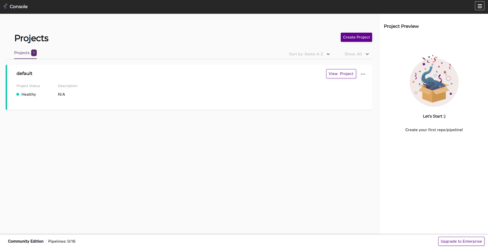
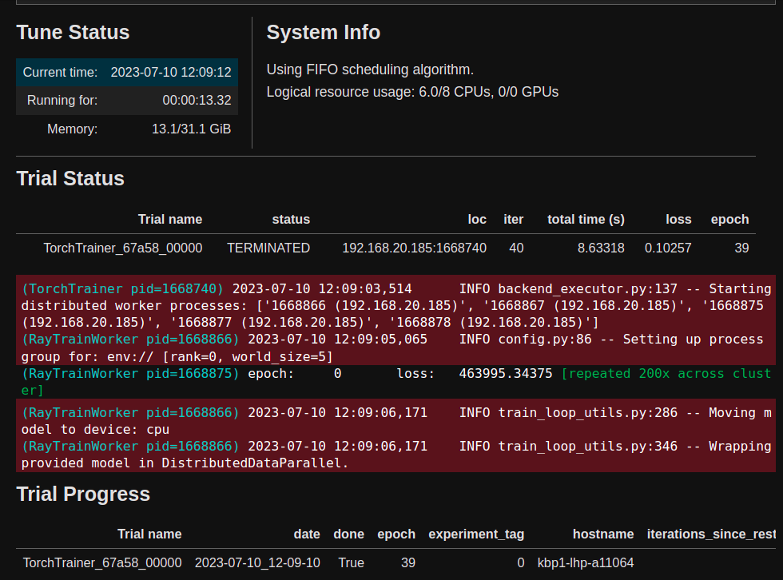

# Efficiency and Scalability. Model Training with the integration of Ray Train and Pachyderm.

Now we are going to combine two powerful tools such as Ray Train and Pachyderm. 
Ray Train provides distributed deep learning training. Pachyderm provides autoscaling, 
parallel processing, version control for data and data-driven pipelines.
Our goal is to utilize the best part of each tool. 
We will use Pachyderm for data processing and Ray for the training model. 
After integrating both tools we can work with data using only one command and it could be distributed across the dataset 
and also parallelize the training process with PyTorch training setup.

After installation and integration, you will be able to train the distributed PyTorch model on the Kubernetes cluster and 
doing data preprocessing into two clicks using the Pachyderm pipeline.

[Ray](https://github.com/ray-project/ray) is an open-source unified framework for scaling AI and Python applications. 
Using Ray can help you to create a distributed  application. You can create scalable tasks like data processing, model training, 
hyperparameter tuning, model serving, and reinforcement learning.  

[Pachyderm](https://github.com/pachyderm/pachyderm) provides automotive data pipelines
with easy understandable data transformation and versioning for all types of data. 


1. set up mikrok8s
2. set up pachyderm 
3. install ray cluster on microk8s
4. Create repo in the pachyderm and add files
5. Create docker container and push it into docker hub
6. Create a configuration file for the Pachyderm pipeline and run a pipeline
7. Prepare code for Ray Train using PyTorch
8. Integrate Pachyderm and Ray Train. Train model.
9. Conclusion


## 1. Set up microk8s
```bash
$ sudo snap install microk8s --classic
$ microk8s start
$ microk8s.enable storage dns ingress
$ microk8s status
```

## 2. set up pachyderm on microk8s
```bash

# instalation pachyderm
$ curl -o /tmp/pachctl.deb -L https://github.com/pachyderm/pachyderm/releases/download/v2.6.5/pachctl_2.6.5_amd64.deb && sudo dpkg -i /tmp/pachctl.deb
$ microk8s helm repo add pachyderm https://helm.pachyderm.com 
$ microk8s helm repo update  

$ microk8s helm install pachyderm pachyderm/pachyderm --set deployTarget=LOCAL --set proxy.enabled=true --set proxy.service.type=LoadBalancer 
NAME: pachyderm
LAST DEPLOYED: Sun Jul  9 17:00:27 2023
NAMESPACE: default
STATUS: deployed
REVISION: 1
NOTES:
```

Now we should check if all works right:

```bash
$ kubectl get po -A
NAMESPACE     NAME                                         READY   STATUS    RESTARTS   AGE
kube-system   calico-node-gpb28                            1/1     Running   0          17m
kube-system   calico-kube-controllers-6c99c8747f-fxqmb     1/1     Running   0          17m
kube-system   coredns-7745f9f87f-2hz92                     1/1     Running   0          17m
default       postgres-0                                   1/1     Running   0          6m19s
default       etcd-0                                       1/1     Running   0          6m19s
default       pachyderm-loki-0                             1/1     Running   0          6m19s
default       pachyderm-proxy-7956c766bd-r8cck             1/1     Running   0          6m19s
default       pachyderm-kube-event-tail-5957785f5d-mf5c4   1/1     Running   0          6m19s
default       pachyderm-promtail-w6fck                     1/1     Running   0          6m19s
default       console-7d6c668794-vtxrv                     1/1     Running   0          6m19s
default       pg-bouncer-686db6477c-9w44m                  1/1     Running   0          6m19s
default       pachd-85fcd887dd-c7d86                       1/1     Running   0          6m19s
```

Let's see all services in the Kubernetes cluster. We should take service with name **pachd-peer** and use CLUSTER-IP and PORT for *pachd* configuration.
```bash
$ microk8s kubectl get service
NAME                        TYPE           CLUSTER-IP       EXTERNAL-IP   PORT(S)                                                 AGE
kubernetes                  ClusterIP      10.152.183.1     <none>        443/TCP                                                 92m
pachd-proxy-backend         ClusterIP      None             <none>        1650/TCP,1657/TCP,1658/TCP,1600/TCP,1656/TCP,1659/TCP   81m
console-proxy-backend       ClusterIP      None             <none>        4000/TCP                                                81m
pachyderm-loki-memberlist   ClusterIP      None             <none>        7946/TCP                                                81m
pachyderm-loki-headless     ClusterIP      None             <none>        3100/TCP                                                81m
etcd-headless               ClusterIP      None             <none>        2380/TCP                                                81m
postgres-headless           ClusterIP      None             <none>        5432/TCP                                                81m
console                     ClusterIP      10.152.183.168   <none>        4000/TCP                                                81m
pg-bouncer                  ClusterIP      10.152.183.170   <none>        5432/TCP                                                81m
pachd                       ClusterIP      10.152.183.156   <none>        30650/TCP,30657/TCP,30658/TCP,30600/TCP,30656/TCP       81m
pachd-peer                  ClusterIP      10.152.183.249   <none>        30653/TCP                                               81m
postgres                    ClusterIP      10.152.183.174   <none>        5432/TCP                                                81m
pachyderm-proxy             LoadBalancer   10.152.183.34    <pending>     80:32049/TCP                                            81m
etcd                        ClusterIP      10.152.183.117   <none>        2379/TCP                                                81m
pachyderm-loki              ClusterIP      10.152.183.37    <none>        3100/TCP                                                81m
```

Could we configure *pachd* using the next command?
```bash
$ echo '{"pachd_address":"10.152.183.249:30653"}' | pachctl config set context local
$ pachctl config set active-context local
$ pachctl version
COMPONENT           VERSION             
pachctl             2.6.5               
pachd               2.6.5 
```

Fine, it means that we successfully install Pachyderm.

We can run Pachyderm dashboard using the command `microk8s kubectl port-forward svc/console -n default 4000:4000`
And we can see. 


## 3. Install Ray cluster on microk8s

```bash
$ microk8s helm repo add kuberay https://ray-project.github.io/kuberay-helm/
$ microk8s helm install kuberay-operator kuberay/kuberay-operator --version 0.5.0
$ microk8s helm install raycluster kuberay/ray-cluster --version 0.5.0
$ microk8s kubectl get pods --selector=ray.io/cluster=raycluster-kuberay
NAME                                          READY   STATUS    RESTARTS   AGE
raycluster-kuberay-head-r9v45                 1/1     Running   0          5m50s
raycluster-kuberay-worker-workergroup-4jlzt   1/1     Running   0          12m
```

```bash
! pip install -U "ray[default]"
! pip install -U "ray[train]"
```

## 4. Create repo in the pachyderm and add files

```bash
$ pachctl create project pach_ray
$ pachctl config update context --project pach_ray
editing the currently active context "local"

$ pachctl config get context local
{
  "pachd_address": "grpc://10.152.183.249:30653",
  "cluster_deployment_id": "************",
  "project": "pach_ray"
}
```


```bash
$ pachctl create repo dirty_data
$ pachctl list repo
PROJECT  NAME       CREATED       SIZE (MASTER) DESCRIPTION 
pach_ray dirty_data 5 seconds ago ≤ 0B 
```


Let's add a file into repo **dirty_data**
The code below generates a simple JSON file which we will put into the repo.
```python 
import json

input_list = list(range(150))
dict_json_data = {'input_data': input_list}


with open('input_data.json', 'w') as f:
    json_object = json.dumps(dict_json_data)
    f.write(json_object)
```

And put json *input_data.json* into  repo *dirty_data*.
```bash
$ pachctl put file dirty_data@master:input_data.json -f input_data.json
```

## 5. Create a docker container and push it into docker hub

Now we should create python function for data processing. Let's create simple linearization.

```python
import json

input_file_name = '/pfs/data/input_data.json'
output_file_name = '/pfs/out/output_data.json'

with open(input_file_name, 'r') as file:
    dict_json = json.load(file)
    linerization = lambda x: 5 * x + 3 * x
    x = dict_json['input_data']
    y = [linerization(sample) for sample in x]

    dict_output = {"input_data": x,
                   "output_data": y}

    with open(output_file_name, "w") as f:
        object_j = json.dumps(dict_output)
        f.write(object_j)
```
So, now we have the *data_preprocessing.py* file which we should put into the docker container. 
The next step is to create a Dockerfile, create an image, and push it into the docker hub.

```dockerfile
FROM python:3.9

RUN python -m venv /opt/venv
ENV PATH="/opt/venv/bin:$PATH"
WORKDIR /app

COPY data_preprocessing.py.py .
```

Create and push the image into the docker hub.
```bash
$ docker build -t pach_ray_integration .
$ docker tag pach_ray_integration eduard1/pach_ray_integration:1.2
# login into docker hub
$ docker login
# push iamge into docker hub
$ docker push eduard1/pach_ray_integration:1.2
```

## 6. Create a configuration file for Pachyderm pipeline and run the pipeline

```yaml
pipeline:
  name: "data_preprocessing"

input:
  pfs:
    glob: "/*"
    repo: "dirty_data"
    
transform:
  cmd: ["python", "data_preprocessing.py"]
  image: "eduard1/pach_ray_integration:1.2"
```
Let's create a pipeline using the command line

```bash
$ pachctl create pipeline -f pipeline_configuration.yaml

# Run that command we should see the created repo and new file
# It means that the pipeline ran successfully
$ pachctl list file data_preprocessing@master
NAME              TYPE SIZE     
/output_data.json file 1.399KiB
```

## 7. Prepare code for Ray Train using PyTorch

Now we should create a dataset class for PyTorch. For this dataset, we need to create a torch data generator.
The generator converts our *output_data.json* into an appropriate type for the train torch model.

```python
from torch.utils.data import Dataset
import numpy as np

class DatasetGenerator(Dataset):
    def __init__(self, data:dict):
        self.x = data["input_data"]
        self.y = data["output_data"]
        
        self.x = np.array(self.x, dtype=np.float32).reshape(-1, 1)
        self.y = np.array(self.y, dtype=np.float32).reshape(-1, 1)
        
    def __len__(self):
        return len(self.x)
    
    def __getitem__(self, index):
        return self.x[index], self.y[index]

```
Next step we should define the model.

```python
from torch import nn


class MyModel(nn.Module):
    def __init__(self):
        super().__init__()
        self.linear_model = nn.Sequential(
            nn.Linear(1, 2),
            nn.SELU(),
            nn.Linear(2,1)
        )
        
    def forward(self, inputs):
        return self.linear_model(inputs)
```

The next step is to create a train function. For train pytorch model. The function we will make minimal changing to prepare for the ray train.


```python
from torch.optim import SGD
from torch.utils.data import DataLoader

LEARNINIG_RATE = 2 * 1e-6
EPOCHES = 40
BATCH_SIZE = 150

def train_model():
    dataset_train = get_data()
    dataloader = DataLoader(dataset_train, batch_size=BATCH_SIZE)
    model = MyModel()
    
    criterion = nn.MSELoss()
    optimizer = SGD(model.parameters(), lr=LEARNINIG_RATE)

    for epoch in range(EPOCHES):
        for inputs, labels in dataloader:
            optimizer.zero_grad()
            pred = model(inputs)
            loss = criterion(pred, labels)
            loss.backward()
            optimizer.step()
        print(f"epoch:\t{epoch}\tloss:\t{loss.item()}")
```

## 8. Integrate Pachyderm and Ray Train 
You can see that we have not declared `get_data` function. The function works on the integration PyThorch dataset and Pachyderm.
For integration, we use [python_pachyderm](https://python-pachyderm.readthedocs.io/en/stable/index.html) package.

```python
import python_pachyderm
import json

def get_data():
    client_pachyderm = python_pachyderm.Client()
    
    # connect to pach_ray project and appropriate file
    dict_input = {"project": "pach_ray",
                 "repo": "data_preprocessing",
                 "branch": "master"}
    
    data_binary = client_pachyderm.get_file(dict_input, "output_data.json")
    
    str_json = data_binary.read()
    str_json = str_json.decode("utf-8")
    dict_data = json.loads(str_json)

    return DatasetGenerator(dict_data)
```

Now, we can check if all works correctly by running `train_model()` and we should see the next:

```bash
epoch:	0	loss:	477928.625
epoch:	1	loss:	470770.5625
epoch:	2	loss:	463455.03125
epoch:	3	loss:	454283.625
epoch:	4	loss:	441476.40625
epoch:	5	loss:	422921.15625
epoch:	6	loss:	396105.40625
              ...
epoch:	35	loss:	0.9757096171379089
epoch:	36	loss:	0.9756918549537659
epoch:	37	loss:	0.9756594896316528
epoch:	38	loss:	0.975640058517456
epoch:	39	loss:	0.9756188988685608
```

Next, our step is to add several lines of code to `train_model()`
So, distributed training for Ray:

```python
from ray.train import torch as torch_ray
from ray.air import session, Checkpoint

def train_model_distributed():
    
    dataset_train = get_data()
    dataloader = DataLoader(dataset_train, batch_size=BATCH_SIZE)
    model = MyModel()
    
    # formatiing to ray train
    dataloader = torch_ray.prepare_data_loader(dataloader)
    model = torch_ray.prepare_model(model)
    # -------------------------
    criterion = nn.MSELoss()
    optimizer = SGD(model.parameters(), lr=LEARNINIG_RATE)

    for epoch in range(EPOCHES):
        for inputs, labels in dataloader:
            optimizer.zero_grad()
            pred = model(inputs)
            loss = criterion(pred, labels)
            loss.backward()
            optimizer.step()
        # -------------
        session.report({"loss": loss.item(), "epoch": epoch},
                      checkpoint=Checkpoint.from_dict(
                      dict(epoch=epoch, model_state=model.state_dict())))
        # --------------
        
        print(f"epoch:\t{epoch}\tloss:\t{loss.item()}")
```

You can see that differences between `train_model` and `train_model_distributed` in the reformation dataloader and model to Ray object, 
and adding `session.report` with `Checkpoint`. That we add if we want to load the model.

The last step is to create Ray Trainer and run it.

```python
from ray.train.torch import TorchTrainer
from ray.air.config import ScalingConfig

use_gpu = False

trainer = TorchTrainer(train_model_distributed,
                      scaling_config=ScalingConfig(num_workers=5, use_gpu=use_gpu))

results = trainer.fit()
```
After running you should see something similar as depicted in the image.


## 9. Conclusion
I 
Now, I now how to integrate togather Pachyderm, Torch and Ray Train.
